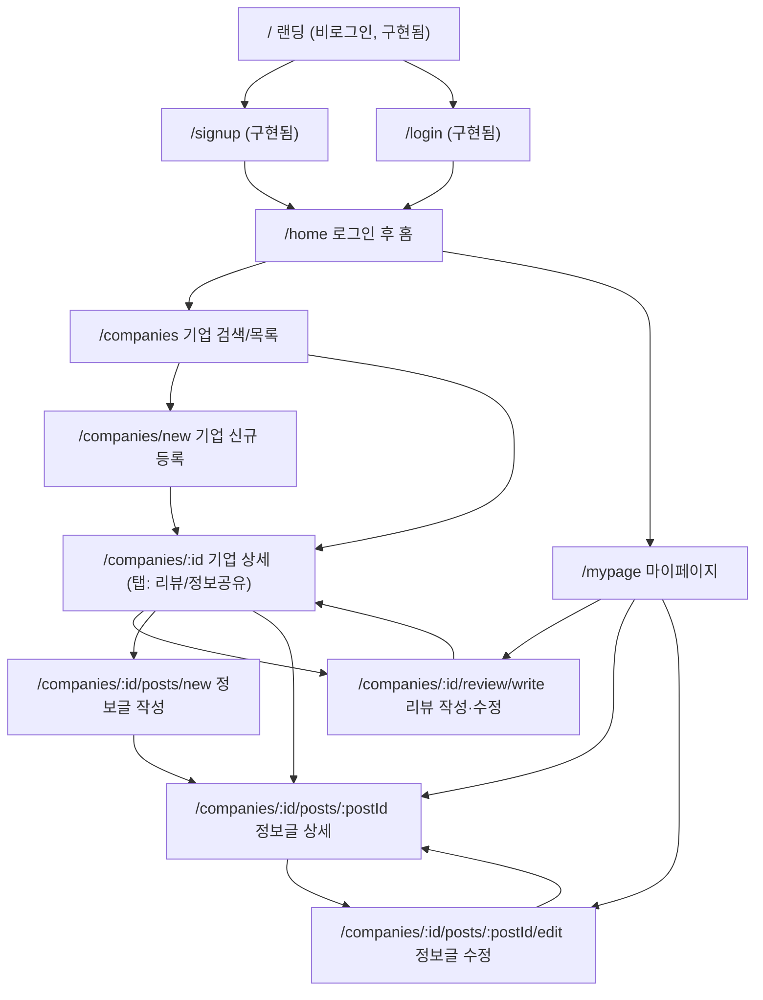

# 거르개 — 화면 정의서

- 작성일: 2026-09-20
- 입력 문서: `docs/superpowers/specs/2026-09-17-gerugae-design.md` (제품 스펙, 이하 "스펙")
- 범위: 스펙 6장에 한 줄로만 적힌 화면들을 실제로 구현 가능한 수준으로 구체화. 이미 구현된 랜딩/가입/로그인/로그아웃은 IA 정리 목적으로만 언급하고, 화면 정의는 신규 대상(로그인 후 홈 재정의 포함) 9개에 대해서만 작성한다.
- 이 문서는 Figma 화면 설계의 입력값이다. 실제 화면에 넣을 한국어 문구를 그대로 제안했다 — 최종 카피는 필요 시 다듬되 의미와 상태 분기는 유지할 것.

---

## 0. 라우트 가드 동작 방식 (신규 화면 추가 시 참고)

`lib/route-guard.ts`는 **허용목록(allowlist)** 방식이다. `PUBLIC_PATHS = ['/', '/login', '/signup']`에 없는 경로는 전부 로그인 필수로 처리되어, 비로그인 접근 시 `/login`으로 리다이렉트된다.

따라서 이 문서에서 신설하는 `/companies`, `/mypage` 등은 **아무 설정을 하지 않아도 자동으로 보호된다.** 실제 배포 환경에서 `/companies` 요청이 307로 `/login`에 보내지는 것을 확인했다.

반대 방향으로 주의가 필요하다. 앞으로 **비로그인에게 열어야 하는 경로**(예: 이용약관, 비밀번호 재설정, 이메일 인증 콜백)가 생기면 `PUBLIC_PATHS`에 명시적으로 추가해야 하며, 넣지 않으면 로그인 화면으로 튕긴다.

---

## 1. 정보 구조 (IA)

### 1.1 사이트맵

### 1.2 URL 표

| 경로 | 접근 권한 | 상태 | 비고 |
|---|---|---|---|
| `/` | 공개 | 구현됨 | 랜딩, 면책문구 |
| `/signup` | 공개(로그인 시 `/home`으로 리다이렉트) | 구현됨 | |
| `/login` | 공개(로그인 시 `/home`으로 리다이렉트) | 구현됨 | |
| `/home` | 로그인 필수 | **재정의 대상** | 현재 자리표시자 |
| `/companies` | 로그인 필수 | 신규 | `?q=`, `?sort=`, `?category=` 쿼리 |
| `/companies/new` | 로그인 필수 | 신규 | `?name=` 프리필 쿼리 |
| `/companies/[id]` | 로그인 필수 | 신규 | `?tab=review\|community`, 기본 `review` |
| `/companies/[id]/review/write` | 로그인 필수 | 신규 | 신규 작성/수정 겸용(존재 여부로 서버가 모드 판단) |
| `/companies/[id]/posts/new` | 로그인 필수 | 신규 | |
| `/companies/[id]/posts/[postId]` | 로그인 필수 | 신규 | |
| `/companies/[id]/posts/[postId]/edit` | 로그인 필수, 작성자 본인만 | 신규 | |
| `/mypage` | 로그인 필수 | 신규 | 닉네임 수정 + 내 리뷰/글 목록 |

### 1.3 공통 헤더(전역 내비게이션)

`/home`, `/companies`, `/companies/[id]`, `/mypage`에 공통으로 노출되는 상단 바. 작성/수정 폼(`review/write`, `posts/new`, `posts/[postId]/edit`)에서는 산만함을 줄이기 위해 로고 + "뒤로가기"만 남긴 축소 헤더를 쓴다.

| 요소 | 내용 | 동작 |
|---|---|---|
| 로고/서비스명 "거르개" | 클릭 가능 | `/home`으로 이동 |
| 검색 아이콘 또는 축소 검색바 | placeholder "회사 이름으로 검색" | 제출 시 `/companies?q=` |
| "마이페이지" | 텍스트 링크 | `/mypage` |
| "로그아웃" | 버튼 | 기존 `LogoutButton` 재사용, 성공 시 `/` |

---

## 2. 공통 규칙

### 2.1 텍스트 길이 제한

| 항목 | 최소 | 최대 | 초과 시 처리 |
|---|---|---|---|
| 기업명 | 1자 | 50자 | 목록/상세 제목은 CSS 말줄임(`...`) + 마우스 오버 시 전체 텍스트 툴팁 |
| 사업자등록번호 | - | 10자리 숫자 | `000-00-00000` 포맷 자동 표시 |
| 리뷰 본문 | 10자 | 1,000자 | textarea `maxlength`로 입력 자체 차단, 실시간 글자수 카운터 |
| 정보글 제목 | 1자 | 60자 | 목록에서 1줄 말줄임 |
| 정보글 본문 | 10자 | 3,000자 | 글자수 카운터, 상세 화면은 전체 노출(줄바꿈 유지) |
| 닉네임 | 1자 | 20자 | 기존 `lib/validation.ts` 규칙 재사용 |

### 2.2 날짜/평점 표기

- 날짜: `YYYY.MM.DD` (예: `2026.03.02`). 수정된 글/리뷰는 날짜 옆에 회색 텍스트로 `(수정됨)` 표기.
- 평균 별점: 소수 첫째 자리까지 반올림 표기 `★4.2`. 리뷰 0건이면 별점 대신 회색 텍스트 `아직 리뷰가 없어요`.
- 별점 입력: 1~5 정수, 별 아이콘 클릭형(반개 단위 없음).

### 2.3 공통 상태 처리 정책

| 상황 | 공통 처리 |
|---|---|
| 데이터 로딩 중 | 해당 영역에 스켈레톤(카드/리스트 행 모양의 회색 블록) 노출. 전체 화면을 가리는 스피너는 최초 진입 시 1회만 허용 |
| 네트워크/서버 오류 (조회) | 해당 영역에 "정보를 불러오지 못했습니다. 다시 시도해주세요." + 재시도 버튼. 화면 전체를 막지 않고 영역 단위로 표시 |
| 네트워크/서버 오류 (저장/제출) | 폼 하단에 인라인 오류 문구, 입력값은 유지, 제출 버튼 재활성화 |
| 세션 만료 상태에서 제출 시도 | "로그인이 만료되었습니다. 다시 로그인해주세요." 안내 후 `/login`으로 이동 (재로그인 후 원래 화면으로 되돌리는 기능은 이번 범위에 포함하지 않음) |
| 존재하지 않는 리소스 id 직접 접근 | "존재하지 않는 {기업/글}입니다." + 목록으로 돌아가는 버튼. 404 페이지를 별도로 만들지 않고 화면 내 상태로 처리 |
| 타인 소유 리소스에 수정 권한으로 접근 | "본인이 작성한 {리뷰/글}만 수정할 수 있습니다." 안내 후 해당 상세/목록으로 리다이렉트 |

---

## 3. 화면별 정의

### 3.1 로그인 후 홈 — `/home`

**목적**: 로그인 직후 도착지. 사용자를 핵심 행동(기업 검색·등록)으로 빠르게 연결하고, 서비스에 새로 쌓인 활동(신규 기업, 최근 리뷰)을 보여줘 재방문 이유를 만든다.

> 이 화면 구성(검색창 + 최근 등록 기업 + 최근 리뷰)은 스펙에 명시되지 않아 이번에 기획자가 제안한 것이다. 5장의 "PM 확인 필요" 1번 항목 참고.

| 구성요소 | 동작 | 상태별 표시 |
|---|---|---|
| 인사말 "{닉네임}님, 안녕하세요" | - | 프로필 조회 실패 시 "안녕하세요"만 표시 |
| 기업 검색 바 (placeholder: "회사 이름으로 검색해보세요") | 제출(엔터/버튼) → `/companies?q={입력값}` | 로딩/오류와 무관하게 항상 활성 |
| "기업 등록하기" 버튼 | `/companies/new` 이동 | - |
| 섹션 "최근 등록된 기업" (최대 5개, 등록일 최신순) — 기업명, 분류 배지, 평균 별점 또는 "리뷰 없음" | 카드 클릭 → `/companies/[id]`. "전체보기" → `/companies?sort=recent` | 로딩: 스켈레톤 카드 5개 / 0건: "아직 등록된 기업이 없습니다. 첫 기업을 등록해보세요." + 등록 버튼 / 오류: "목록을 불러오지 못했습니다" + 재시도 |
| 섹션 "최근 작성된 리뷰" (전체 기업 대상 최대 5개) — 기업명, 작성자 닉네임, 별점, 본문 앞 60자 + "…" | 카드 클릭 → `/companies/[id]?tab=review` | 로딩: 스켈레톤 / 0건: 섹션 자체 숨김 처리(빈 섹션 타이틀 노출 안 함) / 오류: "목록을 불러오지 못했습니다" |

**엣지케이스**
- 회원가입 직후 `profiles` 트리거 반영 지연으로 닉네임 조회가 비어 있을 수 있음 → 인사말만 대체, 나머지 화면은 정상 진행.
- 최근 리뷰 카드는 리뷰 본문이 민감한 정보를 담을 수 있으므로 앞부분만 노출하고 전체 본문은 기업 상세에서만 보게 한다.

**이동 흐름**: 가입/로그인 성공 → `/home`. 로그아웃 → `/`.

---

### 3.2 기업 검색/목록 — `/companies`

**목적**: 이름으로 기업을 찾고, 원하는 기업이 없으면 즉시 등록으로 유도한다.

| 구성요소 | 동작 |
|---|---|
| 검색 입력창 (상단 고정, `?q=`와 동기화) | 입력 후 300ms 디바운스 자동 검색 + 엔터/버튼 제출 |
| 정렬 드롭다운: 최근 등록순(기본) / 리뷰 많은 순 / 별점 높은 순 | 변경 시 목록 재조회, `?sort=` 반영 |
| 분류 필터 칩: 전체(기본) / 원천사 / 에이전시 / 기타 | 선택 시 `?category=` 반영 |
| 결과 리스트 행: 기업명(1줄 말줄임), 분류 배지, 평균 별점(★4.2, 리뷰 12개) 또는 "리뷰 없음" | 행 클릭 → `/companies/[id]` |
| "더보기" 버튼 (페이지당 20개) | 다음 페이지 로드 |
| "찾는 기업이 없나요?" + "새 기업 등록하기" 버튼 | `/companies/new?name={현재 검색어}` |

**상태**

| 상황 | 표시 |
|---|---|
| 최초 로딩 | 스켈레톤 리스트 5~8행 |
| 검색어 있음, 결과 0건 | "'{검색어}'와 일치하는 기업이 없습니다." + "새로 등록하기" 버튼 강조 |
| 검색어 없음, 전체 0건(서비스 초기) | "아직 등록된 기업이 없습니다. 첫 기업을 등록해보세요." |
| 조회 오류 | "목록을 불러오지 못했습니다." + 다시 시도 버튼 |

**엣지케이스**
- 검색어가 공백만 있는 경우 trim 후 빈 값으로 처리(전체 목록 노출).
- 기업명이 50자에 가깝게 긴 경우 리스트에서는 1줄 말줄임만 하고 상세 페이지에서 전체를 보여준다.
- 오탈자로 인한 유사 기업 자동 매칭(예: "가나다"와 "가나다 주식회사")은 하지 않는다 — 사용자가 목록에서 육안으로 판단한다(부분일치 검색만 지원).

**이동 흐름**: `/home` 검색창 → `/companies?q=`. 기업 상세에서 뒤로가기로 복귀.

---

### 3.3 기업 신규 등록 — `/companies/new`

**목적**: 목록에 없는 기업을 새로 등록한다. DB에는 기업명 유니크 제약이 없으므로(스펙 4장), 화면 단에서 중복 등록을 최대한 예방하는 것이 이 화면의 핵심 과제다.

| 구성요소 | 세부 |
|---|---|
| 안내 문구 | "이미 등록된 기업이 있는지 먼저 확인해주세요. 중복 등록은 다른 사용자에게 혼란을 줄 수 있어요." |
| 기업명 입력 (필수, 최대 50자) | `?name=` 쿼리로 진입 시 프리필(50자 초과분은 자동 트리밍) |
| 사업자등록번호 입력 (선택) | 숫자 10자리, `000-00-00000` 자동 포맷 |
| 분류 라디오 (필수): 원천사 / 에이전시 / 기타 | - |
| 유사 기업 실시간 검색 결과 (기업명 입력 300ms 디바운스, 부분일치 최대 5개) | 각 항목에 "이 기업인가요? 상세보기" 링크 → `/companies/[id]` |
| 사업자등록번호 정확 일치 경고 배너 | "입력하신 사업자등록번호로 이미 등록된 기업이 있습니다: {기업명}. [상세보기]" + 체크박스 "그래도 새로 등록합니다"(체크해야 등록 버튼 활성화) |
| "등록하기" / "취소(목록으로)" 버튼 | 등록하기 클릭 시 저장 |

**동작 결과**: 등록 성공 → `companies` insert(`created_by`=본인) → `/companies/[id]` 이동 + 토스트 "기업이 등록되었습니다".

**상태**

| 상황 | 표시 |
|---|---|
| 제출 중 | 등록하기 버튼 비활성화 + 스피너 |
| 유사 기업 없음 | 유사 기업 영역 자체를 숨김 |
| 저장 실패 | "등록에 실패했습니다. 잠시 후 다시 시도해주세요." |

**엣지케이스**
- 사업자등록번호 형식 오류(자릿수 불일치) → "올바른 사업자등록번호 형식이 아닙니다 (예: 123-45-67890)" 인라인 에러, 등록 차단.
- 이름이 유사한 기업이 있음에도 사용자가 그대로 등록을 강행 → DB 제약이 없으므로 등록 자체는 성공한다(스펙에 명시된 정책). 등록 직후 이동한 상세 페이지에 "유사한 이름의 기업이 이미 있어요. 같은 기업이라면 기존 기업 페이지를 이용해주세요" 배너를 한 번 노출한다.
- 두 사용자가 동시에 같은 이름으로 등록(동시성) → 둘 다 성공해 중복 기업 2건이 생성된다. 병합 기능은 없다(스펙 9장 향후 과제) — 화면에서 막지 않고 그대로 허용되는 것이 현재 설계다.

**이동 흐름**: `/companies`(결과 0건) 또는 검색창 → `/companies/new?name=` → 등록 성공 → `/companies/[id]`.

---

### 3.4 기업 상세 — `/companies/[id]` (탭: 리뷰 / 정보공유)

**목적**: 기업의 평판(별점·리뷰)과 실무 정보(팁·Q&A)를 한 화면에서 확인하고, 리뷰/글 작성으로 자연스럽게 이어지게 한다.

**공통 상단 영역**

| 요소 | 세부 |
|---|---|
| 기업명 | 2줄까지 허용 후 말줄임 |
| 분류 배지, 등록일("2026.03.02 등록") | - |
| 사업자등록번호 | 값이 있을 때만 "사업자등록번호 123-45-67890" 표시 |
| 평균 별점 | "★4.2 · 리뷰 12개" / 리뷰 0건이면 "아직 리뷰가 없어요" |
| 탭 | [리뷰] [정보공유], 기본 선택 `리뷰`, `?tab=`으로 상태 유지 |

**리뷰 탭**

| 구성요소 | 동작 |
|---|---|
| "리뷰 작성하기" 버튼(내 리뷰가 없을 때) / "내 리뷰 수정하기" 버튼(있을 때) | `/companies/[id]/review/write` (모드는 서버가 자동 판단) |
| 태그 필터 칩 6개 전부 노출(다중 선택, OR 조건 — 선택한 태그 중 하나라도 포함하면 노출) | 선택/해제 시 목록 즉시 필터링 |
| 리뷰 목록(최신순, 페이지당 10개, "더보기") | 각 카드: 작성자 닉네임, 별점, 태그 칩, 본문(300자 초과 시 "더보기"로 펼침), 작성일((수정됨) 표기) |
| 내 리뷰 카드 | 목록 최상단 고정, "내 리뷰" 배지, "수정" 버튼 노출(타인 카드에는 없음) |

**정보공유 탭**

| 구성요소 | 동작 |
|---|---|
| "글쓰기" 버튼 | `/companies/[id]/posts/new` |
| 글 목록(최신순, 페이지당 10개, "더보기") | 각 행: 제목(1줄 말줄임), 작성자 닉네임, 작성일((수정됨) 표기). 클릭 → `/companies/[id]/posts/[postId]` |

**상태**

| 상황 | 표시 |
|---|---|
| 최초 로딩 | 상단 요약 스켈레톤 + 탭 콘텐츠 스켈레톤 |
| 리뷰 0건 | "아직 작성된 리뷰가 없습니다. 첫 리뷰를 남겨보세요." + 작성 버튼 강조 |
| 태그 필터 적용 결과 0건 | "선택한 태그에 해당하는 리뷰가 없습니다." + "필터 초기화" 버튼 |
| 정보공유 글 0건 | "아직 공유된 정보가 없습니다. 첫 글을 남겨보세요." + 글쓰기 버튼 |
| 존재하지 않는 기업 id | "존재하지 않는 기업입니다." + "기업 목록으로" 버튼 |
| 기업 정보는 로드됐으나 리뷰/글 목록만 조회 실패 | 해당 탭 영역만 "목록을 불러오지 못했습니다" + 재시도, 나머지 정상 노출 |

**엣지케이스**
- 이미 리뷰를 쓴 기업 재방문 → 버튼이 자동으로 "내 리뷰 수정하기"로 바뀌고, 내 리뷰가 목록 최상단에 고정된다.
- 태그 필터와 "내 리뷰 고정 노출"이 충돌하는 경우 — **필터가 우선한다.** 즉 내 리뷰라도 선택된 태그 조건에 맞지 않으면 목록에서 숨긴다.
- 매우 긴 리뷰/제목/기업명은 2.1의 공통 길이 규칙을 따른다.

**이동 흐름**: `/companies` 목록 또는 `/home` 카드 → `/companies/[id]`. 리뷰/글 작성 완료 후 각각 리뷰 탭/정보공유 탭으로 복귀.

---

### 3.5 리뷰 작성/수정 — `/companies/[id]/review/write`

**목적**: 기업에 대한 평가를 별점+태그+자유텍스트로 남기거나(최초 1회), 이후에는 같은 화면에서 내용을 갱신한다. 기업당 1인 1리뷰(스펙 4장)이므로 별도의 "새 리뷰 작성" 경로는 만들지 않는다.

| 구성요소 | 세부 |
|---|---|
| 대상 기업명 | "{기업명}에 대한 리뷰" |
| 별점 선택 | 별 1~5개 클릭형, 필수 |
| 태그 다중 선택 | 고정 6개 칩: 대금지연 / 갑질·부당대우 / 계약불이행 / 소통미흡 / 정산정확 / 재계약의사. 안내 문구 "해당하는 항목을 모두 선택해주세요 (선택사항)" |
| 자유 텍스트 | textarea, 10~1,000자, 실시간 글자수 카운터 "128/1000" |
| 저장 버튼 | 신규: "리뷰 등록하기" / 수정: "수정 완료" |
| 취소 | 뒤로가기. 입력 내용이 있으면 이탈 확인 다이얼로그 "작성 중인 내용이 사라집니다. 나가시겠습니까?" |

**동작**: 진입 시 서버가 (company_id, 본인) 기준 기존 리뷰 유무를 조회해 모드를 결정하고 값을 프리필한다. 저장 성공 → `/companies/[id]?tab=review` 이동 + 토스트("리뷰가 등록되었습니다" / "리뷰가 수정되었습니다").

**상태**

| 상황 | 표시 |
|---|---|
| 기존 리뷰 조회 중 | 폼 스켈레톤 |
| 저장 실패(네트워크/서버) | "저장에 실패했습니다. 다시 시도해주세요." 인라인, 입력값 유지 |
| 유니크 제약 충돌(다른 탭/기기에서 방금 리뷰를 먼저 생성한 레이스 상황) | "이미 이 기업에 리뷰를 작성하셨습니다. 최신 내용을 불러옵니다." 후 자동으로 기존 리뷰를 재조회해 수정 모드로 전환 |

**엣지케이스**
- 본문 10자 미만 → "리뷰 내용을 10자 이상 입력해주세요."
- 별점 미선택 → "별점을 선택해주세요."
- 이 라우트는 항상 "내 리뷰"만 다루므로(author_id를 URL 파라미터로 받지 않음) 타인의 리뷰를 이 화면에서 조작할 방법 자체가 없다.

**이동 흐름**: 기업 상세 리뷰 탭 버튼 → 이 화면 → 저장 후 리뷰 탭 복귀. 마이페이지의 "수정" 버튼에서도 동일 라우트로 진입.

---

### 3.6 정보글 작성 — `/companies/[id]/posts/new`

**목적**: 특정 기업과 관련된 실무 팁이나 Q&A를 자유 형식(제목+내용)으로 공유한다.

| 구성요소 | 세부 |
|---|---|
| 대상 기업명 | "{기업명}에 대한 정보 공유" |
| 제목 입력 | 필수, 최대 60자 |
| 내용 textarea | 필수, 10~3,000자, 글자수 카운터 |
| "등록하기" / 취소 | 취소 시 3.5와 동일한 이탈 확인 다이얼로그 |

**동작 결과**: 등록 성공 → `community_posts` insert(`author_id`=본인) → `/companies/[id]?tab=community` 이동 + 토스트 "글이 등록되었습니다".

**상태**: 제출 중 버튼 비활성화+스피너 / 저장 실패 시 "등록에 실패했습니다. 다시 시도해주세요."

**엣지케이스**
- 제목/내용 중 하나만 입력 → 각각 인라인 에러.
- 제목 60자 초과 입력은 `maxlength`로 원천 차단.
- 같은 사용자가 같은 기업에 정보글을 여러 개 작성하는 것은 허용된다(리뷰와 달리 1인 1건 제약이 스펙에 없음).

**이동 흐름**: 기업 상세 정보공유 탭 "글쓰기" → 이 화면 → 등록 후 정보공유 탭 복귀.

---

### 3.7 정보글 상세 — `/companies/[id]/posts/[postId]`

**목적**: 목록에서 클릭한 정보글의 전체 내용을 읽는다.

| 구성요소 | 세부 |
|---|---|
| 소속 기업명(링크) | 클릭 시 `/companies/[id]` |
| 제목, 작성자 닉네임, 작성일((수정됨) 표기) | - |
| 본문 전체 | 줄바꿈 유지, 접지 않고 전체 노출 |
| "수정" 버튼 | 작성자 본인일 때만 노출 → `/companies/[id]/posts/[postId]/edit` |
| "목록으로" | `/companies/[id]?tab=community` |

**상태**: 로딩 스켈레톤 / 존재하지 않는 postId → "존재하지 않는 글입니다." + 목록으로 버튼.

**엣지케이스**: 마이페이지의 "내가 쓴 글" 목록에서도 동일 라우트로 진입(재사용).

**이동 흐름**: 정보공유 탭 목록 클릭 또는 마이페이지 → 이 화면.

---

### 3.8 정보글 수정 — `/companies/[id]/posts/[postId]/edit`

**목적**: 본인이 작성한 정보글의 제목/내용을 수정한다.

구성은 3.6 작성 화면과 동일하며 기존 값이 프리필되고 버튼 문구만 "수정 완료"로 바뀐다.

**동작 결과**: 저장 성공 → `/companies/[id]/posts/[postId]`(상세)로 이동 + 토스트 "글이 수정되었습니다".

**상태**

| 상황 | 표시 |
|---|---|
| 기존 데이터 조회 중 | 폼 스켈레톤 |
| 저장 실패 | 인라인 오류, 입력값 유지 |
| **본인 글이 아님(권한 없음)** | 진입 즉시 "본인이 작성한 글만 수정할 수 있습니다." 안내 후 정보글 상세로 리다이렉트 |
| 존재하지 않는 postId | "존재하지 않는 글입니다." + 목록으로 버튼 |

**엣지케이스**: 다른 사용자가 URL을 직접 조작해 남의 글 edit 경로에 접근하는 경우가 위 "권한 없음" 케이스에 해당한다. RLS가 update 자체를 막아주지만, 화면 단에서도 작성자 일치 여부를 먼저 확인해 폼을 아예 보여주지 않는다(사용자에게 "저장 눌렀는데 실패" 경험을 주지 않기 위함).

**이동 흐름**: 정보글 상세 "수정" 버튼 또는 마이페이지 "수정" 버튼 → 이 화면 → 저장 후 상세로 복귀.

---

### 3.9 마이페이지 — `/mypage`

**목적**: 닉네임을 관리하고, 본인이 작성한 리뷰/글을 한 곳에서 모아본다.

| 구성요소 | 동작 |
|---|---|
| 프로필 섹션: 현재 닉네임 표시 + "수정" 버튼 | 클릭 시 입력창으로 전환, "저장"/"취소" |
| 섹션 구분: [내가 쓴 리뷰] / [내가 쓴 글] | 탭 또는 세로 섹션 구분(디자이너 재량) |
| 내가 쓴 리뷰 목록(페이지당 10개, "더보기") | 기업명(클릭 시 `/companies/[id]`), 별점, 태그, 본문 미리보기, 작성/수정일, "수정" 버튼(→ `/companies/[id]/review/write`) |
| 내가 쓴 글 목록(페이지당 10개, "더보기") | 기업명, 제목(클릭 시 `/companies/[id]/posts/[postId]`), 작성/수정일, "수정" 버튼(→ posts edit) |

**동작 결과**: 닉네임 저장 성공 → `profiles` update(본인) → 화면에 즉시 반영 + 토스트 "닉네임이 변경되었습니다".

**상태**

| 상황 | 표시 |
|---|---|
| 최초 로딩 | 프로필/리스트 스켈레톤 |
| 내가 쓴 리뷰 0건 | "아직 작성한 리뷰가 없습니다. 기업을 검색해 리뷰를 남겨보세요." + "기업 찾아보기" 버튼(→ `/companies`) |
| 내가 쓴 글 0건 | "아직 작성한 글이 없습니다." |
| 닉네임 저장 실패 | "닉네임 변경에 실패했습니다." 인라인, 기존 값 유지 |
| 목록 조회 실패 | 섹션별 "목록을 불러오지 못했습니다." + 재시도 |

**엣지케이스**
- 닉네임을 공백/빈 값으로 저장 시도 → "닉네임을 입력해주세요." (기존 가입 검증 문구·로직 재사용)
- 닉네임 20자 초과 → "닉네임은 20자 이하로 입력해주세요."
- 닉네임 중복 허용 여부는 스펙에 명시가 없어 이번 정의에서는 "제약 없음(허용)"으로 가정했다 — 5장 질문 참고.
- 리뷰/글 삭제 기능이 없으므로 마이페이지 목록에서 항목이 사라지는 경우는 없다(전제).

**이동 흐름**: 전역 헤더 "마이페이지" → 이 화면. 리뷰/글 "수정"은 각각 write/edit 화면으로 이동하며, 저장 후에는 기업 상세/글 상세로 이동한다(마이페이지로 자동 복귀하지 않음 — 사용자가 뒤로가기 또는 헤더로 재진입).

---

## 4. 전체 사용자 플로우

### 4.1 신규 가입 후 첫 리뷰 작성

1. 랜딩(`/`)에서 "회원가입" → `/signup` → 가입 완료 → `/home`
2. `/home`에서 검색창에 회사명 입력 → `/companies?q=`
3. 검색 결과 없음 → "새 기업 등록하기" → `/companies/new?name=`
4. 유사 기업 없음 확인 후 분류 선택, 등록 → `/companies/[id]`
5. 상세 화면에서 "리뷰 작성하기" → `/companies/[id]/review/write`
6. 별점·태그·본문 작성 후 "리뷰 등록하기" → `/companies/[id]?tab=review`, 방금 쓴 내 리뷰가 최상단에 표시됨

### 4.2 기존 회원의 재방문 — 이미 리뷰를 쓴 기업 확인

1. 로그인 → `/home`
2. "최근 등록된 기업" 카드 또는 검색을 통해 이전에 리뷰를 남긴 기업 상세로 이동
3. 리뷰 탭 진입 시 버튼이 자동으로 "내 리뷰 수정하기"로 표시되고, 내 리뷰가 상단에 고정되어 있음
4. 수정 필요 시 클릭 → `/companies/[id]/review/write`(수정 모드, 기존 값 프리필) → "수정 완료" → 상세로 복귀

### 4.3 정보공유 글 작성/조회

1. 기업 상세 → 정보공유 탭 → "글쓰기" → `/companies/[id]/posts/new`
2. 제목/내용 작성 → 등록 → `/companies/[id]?tab=community`
3. 다른 회원이 같은 기업 상세의 정보공유 탭에서 목록 클릭 → `/companies/[id]/posts/[postId]`
4. 본인 글이면 "수정" 버튼으로 `/companies/[id]/posts/[postId]/edit` 진입 가능, 타인 글이면 버튼 자체가 보이지 않음

### 4.4 마이페이지에서 활동 관리

1. 헤더 "마이페이지" → `/mypage`
2. 닉네임 변경 → 즉시 반영
3. "내가 쓴 리뷰"/"내가 쓴 글" 목록에서 항목 확인, "수정" 클릭 → 각 write/edit 화면 → 저장 후 상세 화면으로 이동

---

## 5. PM 확인 필요 사항 (기획자가 임의로 결정하지 않고 넘기는 항목)

1. **홈 화면 구성**: 이번 문서는 "검색창 + 최근 등록된 기업 + 최근 작성된 리뷰"로 제안했다(3.1). 이 구성이 맞는지, 혹은 다른 우선순위(예: 검색창만 강조)를 원하는지 확인 필요.
2. **리뷰/정보글 삭제 기능 포함 여부**: 스펙 5장 RLS 정책에는 작성자 본인의 DELETE 권한이 명시돼 있으나, 6장 화면 목록에는 "작성/수정"만 있고 삭제 화면 요구가 없다. 삭제 UI를 이번 범위에 포함할지 결정 필요. (포함하지 않으면 DB 권한은 있는데 UI가 없는 상태로 남는다.)
3. **사업자등록번호 중복 시 정책**: 정확히 일치하는 사업자등록번호를 가진 기업이 이미 있을 때, 이번 문서는 "경고 후 체크박스 동의 시 등록 허용"으로 설계했다(3.3). 아예 등록을 막아야 하는 정책인지 확인 필요.
4. **기업 정보(이름/사업자번호/분류) 수정 기능 필요 여부**: 스펙 5장은 "companies는 등록자 외 수정 불가"라고 해서 등록자 본인의 수정은 허용하는 것처럼 읽히지만, 6장 화면 목록에는 기업 정보 수정 화면이 없다. 오탈자 수정 등을 위해 등록자 본인에게 수정 화면을 줄지 결정 필요.
5. **태그 필터 조건(OR/AND)**: 이번 문서는 다중 선택 시 OR(하나라도 포함)로 가정했다(3.4). AND가 맞는지 확인 필요.
6. **닉네임 중복 허용 여부**: 스펙에 유니크 제약이 없어 "허용"으로 가정했다(3.9). 동명 닉네임이 여러 명 존재해도 되는지 확인 필요.

---

## 6. 향후 고려 (스코프 외)

- 리뷰/정보글 댓글 기능
- 신고/블라인드 처리, 관리자 콘솔
- 기업 중복 등록 병합 로직
- 로그인 후 홈의 "추천 기업" 노출(개인화 로직 필요, 이번 범위 제외)
- 이메일 인증 활성화 시 안내 화면(가입 후 "이메일을 확인해주세요" 화면) — foundation 계획 문서에 출시 전 처리로 남겨져 있음
- 마이페이지 회원 탈퇴 기능
- 모바일 네이티브 앱
